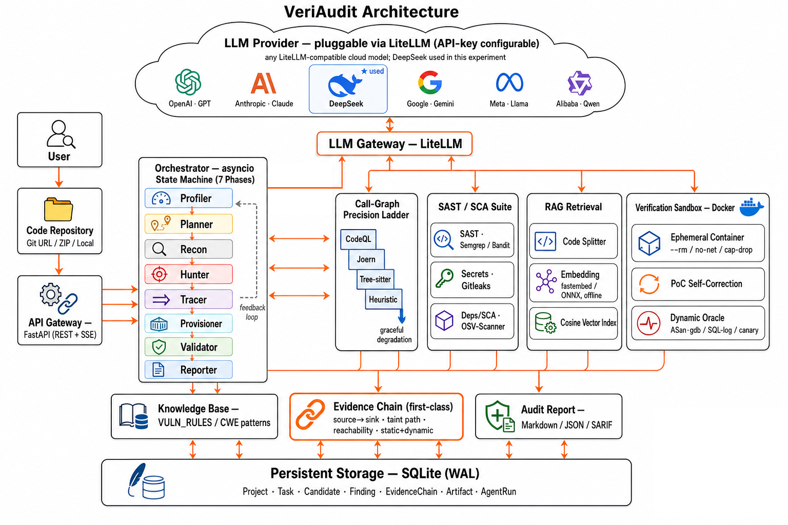
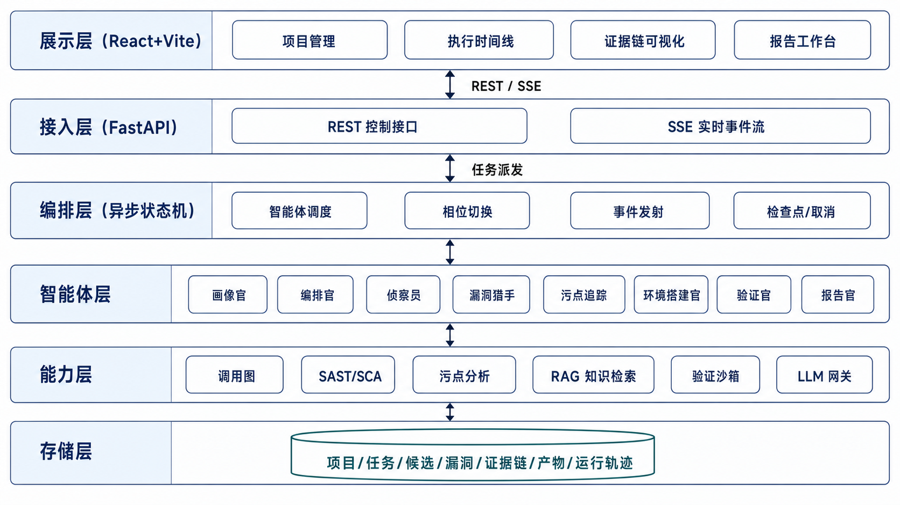

# VeriAudit — 基于大模型智能体的开源项目安全缺陷自动审计和验证系统

> **一句话定位**：VeriAudit 是一套以 **“验证驱动（Verification-first）”** 为核心的多智能体代码安全审计系统。它不满足于“用大模型扫出可疑点”，而是为每一个漏洞给出**可复现的 PoC、完整的证据链（文件位置 → 调用路径 → 污点流 → 验证结果）与置信度分级**，最终产出结构化审计报告。

VeriAudit 面向通用多语言开源项目，由 8 个具备工具调用能力的智能体按 **评估 → 规划 → 侦察 → 发现 → 追踪 → 验证 → 报告** 七个相位协同工作，完成从代码接入到实弹复现再到结构化报告的完整闭环。

**部署与运行请看仓库根目录的 [`LAUNCH.md`](LAUNCH.md)**（全新 Windows 机器满血部署指南，含依赖版本、PATH 配置、`.env` 参数与故障排查）。

---

## 为什么做 VeriAudit（设计出发点）

大模型做代码审计的真正瓶颈**不是“能不能发现漏洞”，而是“误报”**——大模型很容易报出一堆看似成立、实则不可达 / 已被过滤 / 根本触发不到的可疑点；传统 SAST 误报同样严重且看不懂业务逻辑。VeriAudit 的名字（**Veri**fication + **Audit**）即定位：**把“验证”和“降误报”做成第一竞争力**。三条主线贯穿全系统：

1. **可达性优先**：对每个候选漏洞独立追踪 `不可信输入(source) → 危险汇聚点(sink)` 的污点路径，先回答“这个 sink 到底可不可达”——这是降误报最有效的一刀。
2. **双层验证**：静态数据流验证（推理级）+ 沙箱动态 PoC 验证（复现级），并给出**置信度分级**，而非二元的“验证 / 未验证”。
3. **证据链一等公民**：证据链不是报告里的一段文字，而是贯穿全系统、可持久化、可视化、可导出、可追溯的结构化数据对象。

---

## 系统架构（六层解耦）




自顶向下六层，各层通过明确接口解耦：

- **展示层** — React + TypeScript + Vite：实时执行时间线、证据链可视化、报告工作台、历史回看。
- **接入层** — FastAPI：REST 控制接口 + SSE 实时事件流。
- **编排层** — 单进程 asyncio 状态机（LangGraph 式，无外部运行时依赖）：按七相位推进，支持断点续跑与协作式暂停 / 取消。
- **智能体层** — 8 个智能体，经统一工具接口（ToolCall）由大模型自主编排工具。
- **能力层** — 调用图 / 静态扫描 / 污点数据流 / 沙箱 / RAG 检索等**确定性**能力。
- **存储层** — SQLite（WAL），持久化项目、任务、候选、漏洞、证据链、产物与运行轨迹。

最上层的云端大模型经 **LiteLLM 网关**接入，凭 API Key 可接入任意兼容模型（默认三档均为 `deepseek-v4-flash`）；无 Key 时自动进入 **Mock 模式**全程离线可跑。

---

## 8 个智能体 · 七相位

| 智能体（相位） | 主要职责 | 典型可调用工具 |
|---|---|---|
| 画像官 Profiler（评估） | 项目画像、按规模测算自适应预算 | 读取项目元信息 |
| 编排官 Planner（规划） | 制定审计计划、按档位裁剪能力 | 决定是否启用 CodeQL / 环境搭建 / 动态复现 |
| 侦察员 Recon（侦察） | 技术栈 / 框架识别、入口点与攻击面、构建调用图与代码索引 | `cg_*` 调用图、代码索引 |
| 漏洞猎手 Hunter（发现） | 高召回多路候选发现 | `read_file` / `search_code`、`cg_*`、Semgrep / Gitleaks / OSV 扫描、`report_candidate` |
| 污点追踪 Tracer（追踪） | source→sink 污点路径与可达性判定 | `taint_trace`、`cg_dataflow` / `cg_reachable` |
| 环境搭建官 Provisioner（验证前置，仅 deep） | 沙箱内搭起目标应用、预热建会话 | Docker 起容器、`http_probe` 探活、`preheat`（建测试账号 / 多角色会话 / seed 数据） |
| 验证官 Validator（验证） | 独立复核、动态复现、判定置信度 | `http_probe`（多角色会话）、`sql_log`（数据库日志查盲注）、`run_target`（ASan/gdb 原生崩溃取证）、`run_command`（sqlmap/strace 等）、`conclude` |
| 报告官 Reporter（报告） | 固化证据链、生成结构化报告 | 渲染 Markdown / JSON / SARIF、CVSS 评级 |

> 其中**漏洞猎手、环境搭建官、验证官为 agentic 角色**（模型在预算内自主编排工具）。“发现（高召回）”与“验证（全新上下文独立复核）”职责分离，是降误报的结构性保证。

---

## 关键技术

### 调用图精度阶梯
跨过程可达性走精度阶梯 `CodeQL > Joern > Tree-sitter > 文件启发式`：CodeQL 语义级数据流最准（deep 档），Joern 过程间 CPG 次之，Tree-sitter 语法级近似，启发式兜底。四级引擎结果统一归一到一致的 **“调用边”抽象**（调用方 / 被调用方的 文件·函数·行号）。**未命中理想引擎会自动降级，并在控制台顶部弹出醒目“能力降级提示”，绝不静默。** 也支持**手动直供** CodeQL DB / 边表，见下文。

### 双层验证 + 可利用性三关
验证官在判“确认 / 已复现”前必过三关，任一命中即驳回或降级：① **设计使然**（授权主体用刻意功能、未跨信任边界）；② **不安全但不可利用**（无攻击者可控输入真正到达或无真实影响）；③ **不现实前提**（复现依赖概率近零的前提）。置信度分级：`CONFIRMED_DYNAMIC`（动态复现）/ `CONFIRMED_STATIC`（静态确证）/ `SUSPECTED`（存疑）/ `REJECTED`（驳回）。

### 证据链（一等持久化对象）
每个漏洞结构化记录：入口点、source / sink、逐跳污点路径、净化器、可达性、静态判定、动态复现结果；配套“证据产物”保存可执行 PoC、HTTP 请求响应、沙箱日志、探针命中等原始证据。任一结论都能回溯到具体代码行与运行观测。

### 沙箱动态复现 + 三族统一复现
deep 档由环境搭建官把目标在 **Docker 一次性沙箱**内搭起，同一验证器统一复现三大漏洞家族：
- **Web 注入** — 沙箱内实际触发、拿回显（如命令注入 `;id` 回显 root、盲注回读数据库通用日志）；
- **原生内存破坏** — 以 `-fsanitize=address,undefined -g` 重编，**ASan / UBSan 报告或崩溃栈帧**为决定性证据（大项目不整树重编，改按候选编最小 harness 或用 gdb 观察）；
- **逻辑越权 / 鉴权绕过** — 借预热建立的多角色会话复用，对需登录态的接口做越权与鉴权绕过复现。

沙箱自身安全边界：`--rm` 一次性、默认 `--network none`、内存 / CPU / 进程限额、`cap-drop ALL`、`no-new-privileges`、非 root 运行、密钥永不注入沙箱。

### 专业工具集成与编排（诚实分类）
- **带解析器的专用集成**（`app/scanners.py`、`app/callgraph.py`，含 subprocess 调用、结果解析、可用性探测与降级）：Semgrep（缺失时离线回退内置 **Bandit**）、CodeQL、Joern、Tree-sitter、Gitleaks、OSV-Scanner。
- **沙箱内工具，由验证官经 `run_command` 编排**（预装在沙箱镜像，非二次实现工具本身）：gcc/clang + AddressSanitizer/UBSan、gdb、sqlmap、strace、mysql 客户端。其中 **nuclei 为尽力下载**（下载失败镜像照常构建，可能缺席）。
- **RAG 检索**：fastembed（ONNX，**离线**语义嵌入）+ 自建余弦向量索引；不可用时逐级回退到确定性词法哈希索引。另有内置漏洞规则 / 框架知识库（`app/knowledge*.py`）。

---

## 技术栈与选型

| 层 / 关注点 | 选型 | 理由 |
|---|---|---|
| 后端框架 | Python 3.9 + FastAPI + uvicorn | 贴合 LLM 与静态分析工具链；异步 IO 适配 SSE 实时推送 |
| 编排引擎 | 单进程 asyncio 状态机 | 自然表达“带回环的验证流水线”，支持续跑 / 取消，部署轻量 |
| 存储 | SQLAlchemy 2.0 + SQLite（WAL） | 单文件、零运维、可随项目交付复现；经配置可切 PostgreSQL |
| 模型接入 | LiteLLM 网关 + DeepSeek | 抽象多云模型，按智能体分级（强 / 中 / 廉）与整体替换；含离线 Mock |
| 向量检索 | 自建余弦索引 + 可插拔嵌入（fastembed） | 复用主存储、少一组件；离线 / 词法哈希逐级回退 |
| SAST / SCA | Semgrep（Bandit 离线回退）/ Gitleaks / OSV-Scanner | 多语言候选、密钥、依赖 CVE 检测；均按能力探测门控 |
| 调用图 | CodeQL / Joern / Tree-sitter / 启发式 | 四级精度阶梯，按可用性择优并诚实降级 |
| 验证沙箱 | Docker 一次性容器 | 强隔离、语言无关，满足自身安全边界 |
| 前端 | React + TypeScript + Vite | 生态成熟，支持实时时间线与证据链可视化 |

---

## 快速开始

完整步骤（依赖精确版本、D 盘约定、PATH 配置、`.env` 满血基线、故障排查）见 **[`LAUNCH.md`](LAUNCH.md)**。最小上手：

```powershell
# 后端（在已配好外部引擎 PATH 的终端里启动，才能继承并调用它们）
cd backend
python -m venv .venv ; .venv\Scripts\activate
pip install -r requirements.txt
copy .env.example .env         # 满血基线；编辑填入 VERIAUDIT_LLM_API_KEY（不填=Mock）
python -m uvicorn app.main:app --host 127.0.0.1 --port 8000

# 前端（新开终端）
cd frontend
npm install ; npm run dev      # http://localhost:5173
```

> **数据库无需手动创建**：后端启动时自动建库建表（`app/db.py` 的 `init_db()` → `Base.metadata.create_all`，SQLite 文件首次连接时自动生成）。想重置历史直接删掉数据目录下的 `veriaudit.db`（及 `-wal`/`-shm` 附属文件）即可。

**满血自检**：访问 `http://localhost:8000/api/v1/config`，`mock_mode:false`、`sandbox_available:true`、`scanners` 四项、`callgraph.codeql/joern`、`rag_available` 全为 `true` 即满血；任一 `false` 见 `LAUNCH.md` §4 / §9（最常见是该工具不在后端进程 PATH 上）。

**开始审计**：仓库自带 `samples/vulnerable-python/`（含命令注入 / SQL 注入 / 路径穿越 / 硬编码密钥）。首屏「新建项目」→ 选深度档位 → 开始。档位：`fast`（仅静态、跳过沙箱）/ `standard`（静态 + 可复现类沙箱 PoC）/ **`deep`（满血：环境搭建官 + 验证官 agentic 深度核验 / 实弹复现 + 更大预算）**。

---

## 调用图精度：按待审语言的前置条件

要让高精度引擎命中（不希望走到 Tree-sitter 兜底），需按**被审项目的语言**准备环境（CodeQL CLI / joern-cli + JDK17+ 已在 `LAUNCH.md` 装好）：

| 项目语言 | 命中引擎 | 额外需要 |
|---|---|---|
| Python | CodeQL | — |
| JavaScript / TypeScript | CodeQL | —（不需 Node） |
| Go | Joern | 宿主 `go` 在 PATH |
| PHP | Joern | `D:/Tools/php`（自动探测） |
| Java | Joern | —（纯 JVM 前端） |
| Ruby / C·C++ / C# / Kotlin | Joern | C# 需 `dotnet` |

智能体查看调用图的工具：`cg_overview` / `cg_callers` / `cg_callees` / `cg_reachable` / `cg_path` / `cg_subgraph` / `cg_dataflow`（污点数据流：py/js/ts 走 CodeQL、其余走 Joern）。

---

## 手动调用图 / 数据流（大型 / 编译型项目推荐）

无人值守的确定性构建对大型 / 编译型项目成功率不稳定。**手动模式**允许你在审计前离线把调用图 / 数据流建好交给系统消费、跳过自动阶梯：给一个 **CodeQL DB 目录**（调用图 + 污点一体）或 **JSONL 边表**（语言无关兜底）的绝对路径即可。交付契约、构建命令与格式规范见 **[`docs/manual-callgraph.md`](docs/manual-callgraph.md)**。

---

## 项目结构

```text
VeriAudit/
├─ LAUNCH.md / README.md / samples/
├─ docs/manual-callgraph.md      手动调用图/数据流交付契约
├─ backend/
│  ├─ requirements.txt  .env.example（满血基线）
│  └─ app/
│     ├─ main.py config.py db.py models.py schemas.py events.py workspace.py
│     ├─ profiler.py orchestrator.py            画像/规模预算 · 七相位编排
│     ├─ callgraph.py                           调用图/污点（CodeQL/Joern/Tree-sitter 阶梯）
│     ├─ scanners.py analysis.py                Semgrep/CodeQL/Gitleaks/OSV 集成
│     ├─ sandbox.py severity.py report.py       沙箱/ASan 判据 · CVSS · 报告
│     ├─ knowledge.py knowledge_frameworks.py   内置漏洞规则/框架知识库
│     ├─ llm/gateway.py                         LiteLLM 网关（+ Mock 回落）
│     ├─ agents/  planner·recon·hunter·tracer·provisioner·validator·reporter
│     │            + tools/verify_tools/provision_tools/prompts/context
│     ├─ rag/     splitter·embeddings·indexer·retriever·kb
│     └─ api/routes.py
└─ frontend/src/  pages(Home/History/TaskConsole) · lib(theme/SSE/api) · App.tsx
```

---

## 安全声明

VeriAudit 会**克隆并分析不可信代码**、并在沙箱中**执行大模型生成的利用代码**——请仅在**授权范围内**测试。系统对目标代码始终以隔离沙箱承载动态行为，并对自身接入做了 SSRF / zip-slip 等防护；即便如此，运行不可信项目仍存在固有风险，务必在受控环境中使用。
